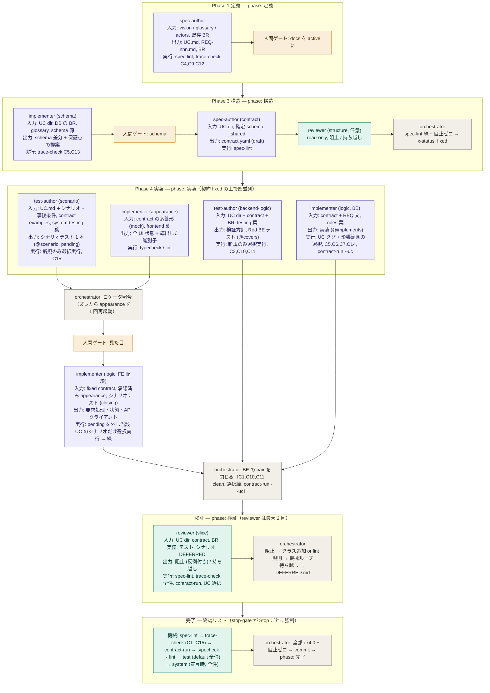

# harness

エージェントの skill / agent / rules の正本を管理する、ベンダー中立の APM モノレポです。必要なパッケージだけ各プロジェクトへ取り込み、Claude / Grok / Codex / Cursor 向けに展開します。特定ベンダーの設定集ではありません。

**正本は `packages/`、実行アセットは `tools/`、書式は `templates/`。`.claude/`・`.agents/`・`.codex/`・`.cursor/`・`.grok/` は生成物で、直接編集しません。** GitHub 上のこのリポジトリで一元管理します。

配布元のこのリポジトリには、各ベンダー向けの生成フォルダを置く必要はありません。必要な消費プロジェクト、または一時的な検証先にだけ展開します。ルートの `AGENTS.md`・`CLAUDE.md` は、このリポジトリ自身の作業規約として残します。

## 必要な用途とスタックだけを選ぶ

| パッケージ | 内容 | 選ぶ場面 |
| --- | --- | --- |
| `develop-core` | develop / attack / docs-migrate の skills、develop agents（5 体）、docs・comments 共通則 | システム開発の共通手続き |
| `rules-next` | Next.js の規約葉だけ | Next.js 開発。通常は develop-core と組み合わせる |
| `rules-crow` | crow の規約葉だけ | crow 開発 |
| `rules-expo` | Expo の規約葉だけ | Expo 開発 |
| `rules-swiftui` | SwiftUI の規約葉だけ | SwiftUI 開発 |
| `translate-manga` | 韓日漫画翻訳の skill・maker / judge・翻訳規約 | 漫画翻訳。develop は入らない |
| `produce-video` | 動画制作定義の skills・agents・規約 | 動画の企画・台本・素材定義 |
| `render-media` | メディア生成の skills・agents・規約 | 制作定義から実メディアへ変換 |
| `grilling` | grilling / grill-me の skills | 計画・設計のインタビュー |

**root の全部入りパッケージはありません。** 複数用途が必要なプロジェクトは、必要なパッケージをそれぞれ明示します。Next.js 向けに develop-core と rules-next を選んでも Expo・SwiftUI・crow・漫画翻訳は入りません。

## APM で導入する

消費プロジェクトの `apm.yml` に、選ぶパッケージだけを記述します。下は Next.js の例です。

```yaml
name: my-next-app
version: 1.0.0
targets: [codex] # claude / cursor / grok-build など、使う対象を明示
dependencies:
  apm:
    - tsay-dev/harness/packages/develop-core
    - tsay-dev/harness/packages/rules-next
```

```bash
# 消費プロジェクトで実行
apm install

# CLI から依存を追加する場合
apm install --target codex tsay-dev/harness/packages/develop-core
apm install --target codex tsay-dev/harness/packages/rules-next
```

Expo は `rules-next` を `rules-expo` に、SwiftUI は `rules-swiftui` に、crow は `rules-crow` に替えます。翻訳だけなら `translate-manga` のみを指定します。上の GitHub 例は、この構成を含む版が公開された後に使えます。公開前のローカル検証、対象ハーネスの選択、固定版、更新、既存ホストの移行は [APM 導入ガイド](docs/apm.md)を参照してください。

APM は標準の `install` / `compile` を提供しますが、**このハーネスでは常駐ゼロのため `install` を基本にし、規約本文を root の `AGENTS.md` などへまとめる `compile` は実行しません**。遅延ロードを持たない対象では、skill 起動後に `apm_modules/` にある選択済み規約の対象メタデータを調べ、必要な葉だけを担当 agent に渡します。

### 一緒に入らないもの

他用途・他スタックは依存に指定しなければ入りません。`tools/` と `templates/` は APM パッケージ外です。検証や制作で必要な場合だけ、このリポジトリを別途 `.harness/` などへ取得し、その版を固定します。

```bash
# 例: 実在するリリースタグを指定して別途取得する
# git clone --branch <release-tag> https://github.com/tsay-dev/harness.git .harness
```

develop の spec-lint / trace-check、文書テンプレート、render 用アダプタなどを使う工程では、対応アセットを先に用意します。フック・CI・ブランチ保護の設置と検証コマンドの宣言は消費プロジェクトの責務です。`settings.json` を自動ルーターにしません。

## 常駐ゼロの意味

インストール単位と読み込み単位を分けます。まず用途とスタックで不要なファイルを入れず、そのうえで作業に必要な本文だけを読みます。skill の発見用メタデータまで存在しないという意味ではなく、規約本文をベースラインへ常時注入しない方針です。

- 手続きは skill の明示起動、または description による発見が入口です。
- 規約葉の正本は APM の中立メタデータ `applyTo` で対象ファイル群を宣言します。Claude 向け展開では `paths:` に変換します。
- 他ハーネスに Claude 相当の遅延ロードがあるとは仮定しません。必要な規約だけを skill が担当 agent へ渡します。
- craft は各 agent の本文に置き、起動時に読みます。書式の正本は `templates/` に置きます。
- 常駐する索引、ルーター用の `AGENTS.md` / `CLAUDE.md`、settings の自動注入は作りません。

規約の対象範囲は「担当者が書くファイル」で決めます。テスト規約ならテストの住所、DB 規約なら native スキーマの住所です。広すぎる glob も狭すぎる glob も誤配布になるため、パッケージを分けた後も対象を精密に保ちます。

## 正本の構成

APM が認識する package anatomy に従い、各パッケージは `apm.yml` と `.apm/` を持ちます。利用する種類だけを置きます。

```text
harness/
  packages/
    develop-core/
      apm.yml
      .apm/
        skills/<name>/SKILL.md
        agents/develop/<name>.agent.md
        instructions/<scene>-<concern>.instructions.md
    rules-next/          # apm.yml + .apm/instructions/
    rules-crow/
    rules-expo/
    rules-swiftui/
    translate-manga/     # skill + agents + instructions
    produce-video/
    render-media/
    grilling/
  tools/                 # 検証・生成器など。APM外
  templates/             # 文書書式。APM外
  docs/apm.md
  init.sh                # 選択パッケージからの互換展開
  README.md
  AGENTS.md
  CLAUDE.md
```

APM 0.30.0 の instruction 探索は `.apm/instructions/` 直下です。旧 scene / platform / framework / layer の関係はファイル名に残し、APM が見つけられない独自ツリーを作りません。規約は一葉一関心で、共通則を各 framework の葉へ複製しません。

## 開発・翻訳の手続きは維持する

配布単位を変えても、**作る主体と判定する主体を別 agent・別コンテキストに分ける**原則は変えません。skill は orchestrator の不変条件と完成の定義（手順は同梱の `references/` に任意参照）、agents は別コンテキストが要る役割の craft、instructions は規約です。skill が規約本文を要約・複製しません。

壊れてはいけないこと（人間ゲート、producer ≠ judge、終端の検査リスト、閉じた語彙）は hook と lint で硬く強制し、うまくやる方法（順序・深さ・起動順）は skill の既定として柔らかく置きます。agent は「別コンテキストが必要か」（隔離・並列・独立性）でだけ分けます。

各 agent の実行モデルは、中立な `x-model-tier`（top / mid / light）を agent source に一度だけ宣言します。provider 固有の family や version slug は adapter の tier 対応表へ分離し、agent 名の割当表を別に作りません。native APM がモデル指定を変換しない場合は、orchestrator が元 source の tier を起動時に適用します。

develop の agent は 5 体です。`spec-author`（domain / UC / REQ・BR / 契約）、`test-author`（実装を読まずに書く。`track: backend-logic` は分割クラスと Red の BE テスト、`track: scenario` は UC 主シナリオの写しであるシナリオテスト 1 本）、`implementer`（logic / appearance / schema / probe のモード）、`reviewer`（別コンテキストの反証、read-only）、`attacker`（`/attack` 専用）。orchestrator は実装とテストを書かず、commit と ADR は skill 同梱の手順（`references/commit.md` / `adr.md`）に従って自分で行います。

完成の定義は終端の閉じたリストです: spec-lint、trace-check、contract-run（契約の examples をホストのアダプタ経由で実行）、ホストの typecheck / lint / test、宣言時は system（シナリオテスト全件を 1 回）、そして reviewer の `阻止` ゼロ。reviewer の指摘は `阻止`（機械検査に変換できる反例付き）と `持ち越し` の 2 段で、`持ち越し` は `docs/verification/DEFERRED.md` に記録して同一スライスでは直しません。ホストは Claude Code の Stop hook に `tools/gate-hook/stop-gate.mjs` を明示設置すると、終了時に機械がこのリストを強制します。

`attack` は人間が依頼する任意の攻撃で、develop の通常ループには混ぜません。翻訳では maker が Stage 1–4 を通して訳し、翻訳を書いていない judge が Stage 5 の独立レビューを行います。工程・役割の詳細は各 skill / agent が正本です。

### docs の SDD / SSOT

成果物は 1 ID 1 ファイルです。縦の `GOAL → UC → REQ` は `docs/goals/GOAL-nn/UC-nnn/` の木に一致させ、横断する BR / NFR / ADR / glossary は中央に置きます。DB 設計は docs の案ではなく、ホストの migration / schema.prisma / model など native スキーマに書きます。

人間ゲートの文書は `draft → active → withdrawn`、機械ループの契約は `draft → fixed`。工程状態は各 `UC.md` の `phase:` が持ち、導出できる台帳はコミットしません（`docs/verification/DEFERRED.md` は反例を持つ内容なので唯一の例外）。テストは `@covers REQ-nnn#class`、シナリオテストは `@scenario UC-nnn`、実装は `@implements REQ-nnn / BR-nnn / UC-nnn` で上流を指します。spec-lint は書式・ライフサイクル・契約のキー閉集合、trace-check は C1–C15 のトレーサビリティ、contract-run は契約 examples の実行を検証し、既存違反には baseline ラチェットを使います。契約の `errors` の並びが唯一の評価順で（R-1207）、散文に順序を再掲しません。

### 進捗は保存せず、GOAL の成立から導出する

プロジェクトの「今どこまで」は、どこにも書き込まず、その都度 `tools/goal-status` で導出します（ADR-0038）。分母は人が決めた `active` な GOAL、分子は終端リストの実行結果と trace-check の違反です。`UC.md` の `phase:` は orchestrator の申告なので判定には使わず、申告と観測が食い違う件数だけを添えます。

GOAL の状態は `true` / `false` / `unobserved` の 3 値です。`true` は「条件（`active` な REQ）があり、配下を名指しする違反が無く、終端リストが実行されて通った」ときだけで、baseline に載せた違反・未宣言の `commands.test`・条件の無い GOAL はどれも `true` になりません。出力には観測時刻とコミット、未コミットの件数、`DEFERRED.md` の件数が付きます。goal-status は報告であってゲートではなく、終了コードは状態を表しません。

```bash
node .harness/tools/goal-status/goal-status.mjs          # 人が読む表（未達だけを詳しく）
node .harness/tools/goal-status/goal-status.mjs --json   # 一覧画面などの集約側が読む JSON
```

GOAL が扱うのは製品の振る舞いです。公開・デプロイ・KPI はこの報告の外にあります。

### シナリオテスト（E2E）の位置づけ

ブラウザ・シミュレータ・実機を起動する system suite は、**UC の主シナリオの実行可能な写し**として develop の phase の内側に置きます（ADR-0035〜0037）。SSOT は `UC.md` の主シナリオと事後条件、表示文言は `01-glossary.md`、識別子は `contract.yaml` の operation 名と request フィールド名で、テストコードを SSOT にはしません。1 UC につき正常系 1 本だけを書き、失敗系・境界は REQ の分割クラス（デフォルトスイート）が担います。書く時期は契約 `fixed` 直後で、実装と同時に `test-author (track: scenario)` が pending マーカー付きで filing し、FE 配線の `implementer (logic)` がマーカーを外して緑にします。走らせるのは境界だけ（修正ラウンドでは当該 UC の選択のみ、終端リストと CI で全件）で、赤緑ループには混ぜません。

#### 誰が・いつ・どの SSOT から・何を走らせるか



生成する側（紫）と判定する側（緑）は必ず別コンテキストで、orchestrator（灰）は状態遷移と照合だけを行います。

#### テストを走らせる瞬間

| 走らせる瞬間 | default（単体・契約準拠） | integration | system（シナリオ） |
| --- | --- | --- | --- |
| test-author が filing した直後 | 新規テストだけ選択実行（Red 確認） | — | 新規 1 本だけ選択実行（Red / pending 確認） |
| 修正ラウンド（implementer） | UC タグ + 影響範囲の選択 | — | FE 配線のときだけ当該 UC の 1 本 |
| reviewer（slice） | UC タグの選択 | — | — |
| 終端リスト（commit 前、stop-gate） | 全件 1 回 | — | 全件 1 回（`commands.system` 宣言時） |
| CI | 全件 | 全件 | 全件 |

修正ラウンドで default / system の全件を撃つことは禁止です。integration の走らせ方はホストが定義します。

#### シナリオテストが赤になったときの三分岐

orchestrator が必ずこの順で診断し、「テストが落ちたから UC を直す」へ直行しません。

1. 主シナリオと契約が既にその動作を決めている → **実装の欠陥**。`implementer (logic)` に artifact 単位の制約として戻す。
2. テストが主シナリオに無い手順や DOM 構造を固定している → **SSOT は正しい**。`test-author (track: scenario)` に再導出させる。
3. 主シナリオ自体がその操作を表現できない → **SSOT 変更**。`spec-author` 🙋 で `UC.md` を直し、テストと実装の両方を再導出。

## APM と旧 init.sh の使い分け

新規消費プロジェクトでは APM でパッケージを選びます。`init.sh` と provider-sync は、APM を使わない環境の互換展開・リポジトリ開発時の生成確認のために残します。入力は同じ中立ソースです。

**同じ消費プロジェクトで APM と `init.sh` の管理を混ぜません。** 旧 `.claude` symlink / submodule / copy の環境は、新方式を上書き実行せず、版とローカル変更を確認してから移行します。手順は [docs/apm.md](docs/apm.md) にあります。

## このリポジトリを編集するとき

1. [CLAUDE.md](CLAUDE.md) の作業規律を読む。Codex の入口は [AGENTS.md](AGENTS.md)。
2. `packages/`、`tools/`、`templates/` の該当する正本を修正する。
3. パッケージの認識・単独導入・不要用途の混入なし・参照の到達性を確認する。
4. 選んだ対象向けの生成物を再生成して差分を確認する。**生成物を直接直さない。**

会話、docs 成果物、コミットメッセージ、コード内コメントは日本語。プロンプト正本・ツール README・テンプレートのガイダンスは英語を基本とし、テンプレートの日本語見出しは維持します。案件固有の事実は各消費プロジェクトの `AGENTS.md` / `CLAUDE.md` に書きます。
