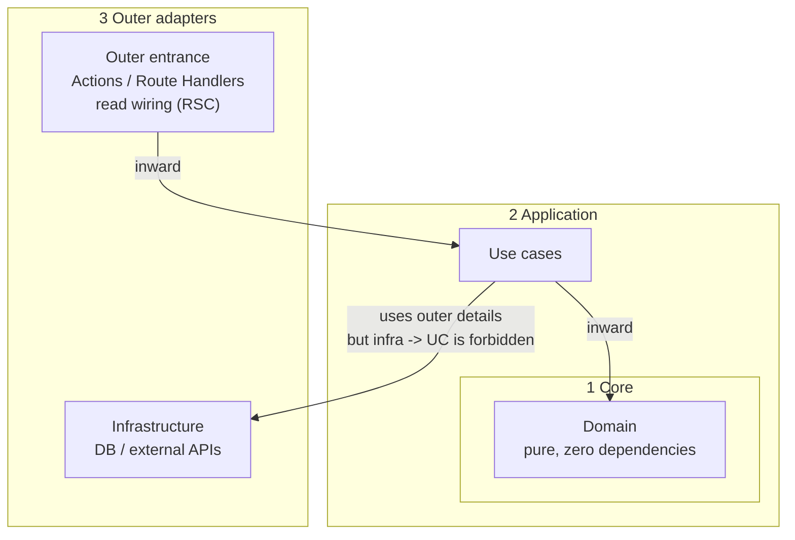

# ⚙️ Next.js / backend — separation of responsibilities (the server-side delta)

> **Scope: server-side processing on Next.js (App Router).** If it is not Next.js, treat this document as inapplicable and discard it.
>
> **The common rules are [common/coding.md](common-coding.instructions.md)** (formatting is the tool's; never weaken types to get to green;
> named exports, no barrels, path aliases; secrets and `NEXT_PUBLIC_`).
> How to write tests is [testing.md](backend-testing.instructions.md) (the common wiring is [common/testing.md](common-testing.instructions.md)).
> This document defines, **on top of following those**, only where server-side logic goes. It never restates the common side.
>
> **The harness does not pin directory names.** Locations are recorded in the project's `CLAUDE.md`.
> **What is pinned is the separation of roles itself.** `domain/` and the like appearing in `applyTo` are discovery signals, not mandatory folder names.
>
> **Write comments and user-facing text in Japanese.**

---

## 0. Defining the goal (what is lost when they mix)

In the App Router, both Server Components and Server Actions run on the server.
So you can write DB access and decisions right next to the UI **and it will work**.

What breaks is not "working" — it is that the following are lost at the same time:

- A domain decision cannot be tried in isolation (the DB and `next/*` become shackles)
- The same decision gets copied into an Action, a page, and a Route Handler
- Cache invalidation and redirects eat into the business logic and become impossible to replace

**This document's job is to close the loopholes that let responsibilities mix into one function (a fat action).**

---

## 1. Four roles. The location does not matter

| Role | Responsibility | What it must not contain |
| --- | --- | --- |
| **Domain** | business rules, decisions, calculations | side effects such as DB / HTTP / the clock / randomness. `next/*` |
| **Infrastructure** | side effects: DB access, external APIs, sending mail | complex business decisions and branching (domain knowledge) |
| **Use case** | orchestrating the scenario (assembling fetch → decide → save) | Next-specific APIs such as `revalidatePath` / `redirect` / `cookies` / `headers` |
| **Outer entrance** | validating untrusted input, invoking the use case, Next/HTTP-specific I/O | the substance of DB operations or domain decisions |

The **outer entrance** has 2 implementation forms (both are the outer ring of the onion; the role name is the same, "entrance"):

| Implementation form | When to use it | How success/failure is carried to the caller (details in §6) |
| --- | --- | --- |
| **Mutation controller — Server Actions** | changing server-side truth from within the same app | **a caller-facing Result**. Never expose a raw exception stack |
| **Mutation controller — Route Handlers** | HTTP for external consumers | **an HTTP status + body** (returning the same Result shape as JSON is fine) |
| **Read wiring** (RSC in `page.tsx` / `layout.tsx`) | reads such as the initial render | **`notFound()` / error UI / mapping into view props**. A Client-facing Result type is not mandated |

**Example directories** (not binding):

`domain/` · `infrastructure/` · `use-cases/` · `app/actions/` (or Route Handlers) · `app/**/page.tsx` (read wiring)

**Never mix the roles above into one function or module.**

### 1.1 Who owns the implementation (who writes what)

| Deliverable | Implementer |
| --- | --- |
| **The substance of the domain / use cases / infrastructure** | **backend-logic** |
| **The substance** of Server Actions / Route Handlers (validation, invoking the use case, `revalidatePath`, and so on) | **backend-logic** |
| The **read wiring** in `page` / `layout` (validating params, invoking an **existing** use case, passing props to the view) | **frontend-logic** |
| Presentational appearance | **frontend-ui** |
| `middleware.ts` (the thin edge only — [common/coding.md](common-coding.instructions.md) §4) | **backend-logic** (declare it in the project `CLAUDE.md` if you split it out) |

The frontend only **calls** use cases and Actions and **passes them through props**; it never creates or swells the substance.
When a use case a read needs does not exist yet, **prepare it on the backend-logic side first** (so the FE does not escape into calling infra directly or into creating a use case).
The backend does not build a page's JSX.

---

## 2. Dependencies (the onion: dependencies point inward only)

The layers are concentric like an onion. **Source references (imports) always point inward.**

```text
┌──────────────────────────────────────────────────────────────┐
│ ③ Outer adapters (the framework and I/O are visible)          │
│                                                              │
│   Outer entrance                    Infrastructure           │
│   · mutation controllers            DB / external APIs       │
│     (Actions / Route Handlers)                               │
│   · read wiring (RSC page/layout)                            │
│        │                              ▲                      │
│        │ calls                        │ uses (details)       │
│        ▼                              │                      │
│   ┌───────────────────────────────────┴────────────────────┐ │
│   │ ② Application — use cases                              │ │
│   │    assembling the scenario (read → decide → write)     │ │
│   │                      │                                 │ │
│   │                      ▼ asks for a decision             │ │
│   │         ┌────────────────────────────┐                 │ │
│   │         │ ① Core — domain            │                 │ │
│   │         │ pure business rules,       │                 │ │
│   │         │ calculations               │                 │ │
│   │         │ (knows nothing outside)    │                 │ │
│   │         └────────────────────────────┘                 │ │
│   └────────────────────────────────────────────────────────┘ │
└──────────────────────────────────────────────────────────────┘
```



| Ring | Layer | References it may make | Forbidden |
| --- | --- | --- | --- |
| ① core | **Domain** | none (pure processing only) | infrastructure, use cases, the outer entrance, `next/*` |
| ② | **Use case** | the domain (mandatory). May use infrastructure for the assembly | the outer entrance; Next APIs such as `revalidatePath` |
| ③ outer | **Outer entrance** | use cases (+ schema validation at the edge) | writing infrastructure or domain substance inline. Never complete business between entrances |
| ③ outer | **Infrastructure** | the DB, HTTP clients, and so on | use cases, the outer entrance. Business decisions |

Key points:

- **The outer entrance and infrastructure sit in the same outer ring.** Never wire them directly to each other to get business done (always go through a use case)
- **The domain is the core** and depends on nobody
- **The use case is the layer that uses the outside while protecting the core**

At runtime (a mutation): mutation controller → use case → (read via infra → decide in the domain → write via infra) → state success/failure to the caller (a Result for Actions, status + body for RH) / `revalidatePath` and the like where needed.
At runtime (a read): read wiring → use case → props to the view (§3).

---

## 3. Choosing the entrance

| Purpose | The outer entrance's implementation form |
| --- | --- |
| **A mutation within the same app** | **Server Actions** (a mutation controller), by default |
| **HTTP exposed externally** | **Route Handlers** (`route.ts`) |
| **A read** (the initial render of a list or a detail view) | **Read wiring** (RSC). The thinness of the UI is [frontend/coding.md](frontend-coding.instructions.md). Never multiply Server Actions for reads |

All of these are the outer entrance, and **infrastructure and the domain are never written inline into an entrance.**

---

## 4. The flow of a use case

What a use case may write is, roughly, only the following assembly.

1. Read via infrastructure
2. Decide and calculate in the domain
3. Write via infrastructure if needed

The use case returns a **scenario result** (success data or a reason code).
Align the field names across the project. The mutation controller maps that into **the caller-facing shape** (§6: a Result for Actions, status + body for RH).

```ts
//  OK: オーケストレーションだけ（シナリオ結果の例。形はプロジェクトで統一）
export async function renameUser(input: { id: string; name: string }, deps: Deps) {
  const current = await deps.users.findById(input.id);
  if (current === null) return { ok: false as const, reason: "not_found" as const };
  const decided = decideDisplayName(current, input.name); // ドメイン（純粋）
  if (!decided.ok) return decided;
  await deps.users.save(decided.user);
  return { ok: true as const, user: decided.user };
}
```

```ts
//  NG: ユースケースが Next に依存する
import { revalidatePath } from "next/cache";
//  NG: ユースケースに SQL／業務の長い分岐が同居する
```

`revalidatePath` / `redirect` / cookie operations go in the **mutation controller**.

---

## 5. Runtime validation at the trust boundary (zod)

A TypeScript type is a promise made only at compile time.
**Values arriving from outside** get **runtime schema validation (zod or similar) at the outer entrance's edge**, and only what passes is handed to the use case.

| Entrance | Examples of what to validate |
| --- | --- |
| Mutation controller | a Server Action's arguments; a Route Handler's body / query |
| Read wiring | `params` / `searchParams` (whichever are needed) |

- **Validating once at the edge is enough.** "zod again" at the use case's entrance or in the domain is not required
- Business invariants are the domain's responsibility and are never a substitute for schema validation
- The default library is zod. A project using a different one declares it in `CLAUDE.md`

```ts
//  ミューテーション・コントローラー（Server Action）側のイメージ
const parsed = CreateUserSchema.safeParse(raw);
if (!parsed.success) {
  return { success: false as const, error: "入力が不正です" };
}
const outcome = await createUser(parsed.data, deps);
if (!outcome.ok) {
  return { success: false as const, error: toUserMessage(outcome.reason) };
}
revalidatePath("/users");
return { success: true as const, data: outcome.user };
```

The read-wiring picture of validation is [frontend/coding.md](frontend-coding.instructions.md) §2.

---

## 6. How failure is carried (split by the entrance's implementation form)

### Mutation controllers (Server Actions and Route Handlers)

Both are the same outer-entrance role. Never leave an exception to propagate and expose a raw stack to the caller.
**Success and failure must be distinguishable by the caller.** Align on **one scheme** for carrying it across the project.

| Implementation form | An example of the discrimination (not fixed) |
| --- | --- |
| Server Actions | a shared caller-facing Result (the example below) |
| Route Handlers | an HTTP status + body (returning the same Result shape as JSON is fine) |

```ts
//  Server Actions 向けの例（固定ではない）
type ActionResult<T> =
  | { success: true; data: T }
  | { success: false; error: string };
```

The use case's scenario result (§4's `ok` / `reason`, and so on) and the caller-facing shape **may be different things**.
The mutation controller maps between them at the edge. Never mix the field names across demos and implementations.

### Read wiring (RSC)

An ActionResult type returned to the Client is not mandated. State it instead through one of the following:

- Invalid `params` → reachable UI such as `notFound()`
- A failed fetch → leave it to `error.tsx`, or pass error / empty through view props ([frontend/components.md](frontend-components.instructions.md))

---

## ✅ Checklist before returning

- [ ] Is any dependency arrow flowing backward?
- [ ] Does the domain hold side effects or `next/*`?
- [ ] Has business branching sunk into infrastructure?
- [ ] Does a use case import `revalidatePath` / `redirect` / `cookies` and the like?
- [ ] Is infrastructure being called directly from anywhere but the outer entrance?
- [ ] Has the substance of Actions / Route Handlers been swollen on the frontend side (§1.1)?
- [ ] Is the primary entrance for mutations Server Actions (Route Handlers for external HTTP)?
- [ ] Are values arriving from outside schema-validated at the edge before reaching the use case?
- [ ] On a mutation, can the caller distinguish success from failure? (Actions = Result, RH = status + body; reads follow §6's RSC handling)
